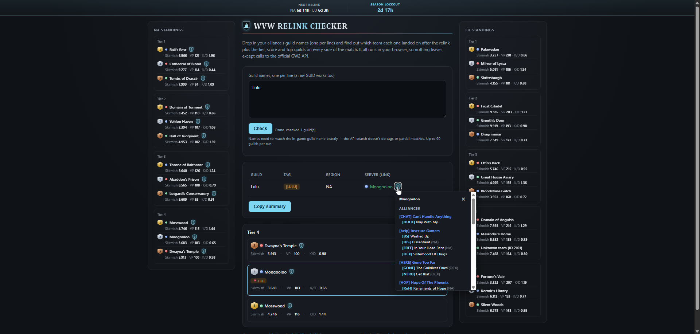

# WvW Relink Checker

[](https://melquiisedeq.github.io/wvw-relink-checker/)
[](LICENSE)

A single-file web tool for Guild Wars 2 WvW alliances. Paste a list of
guild names and instantly see which team each one landed on after a
relink, plus live tier standings for every NA and EU match.

**[Open the live tool](https://melquiisedeq.github.io/wvw-relink-checker/)**



## Why this exists

After every WvW relink, alliance members ask the same question: which
server did we land on? Checking manually means looking up each guild's ID
and cross referencing it against the API by hand. This tool does it for a
whole list of guilds at once, and shows live match data on top.

## Features

**Guild lookup**
- Paste guild names, one per line, and get the region, server, and current
  match context for each.
- Marks which side your guild landed on, right in the results.
- Two one-click copy buttons build a shareable summary of who you're
  fighting with and against:
  - **Copy for chat**: a compact, tags-only version that fits the
    in-game chat's character limit.
  - **Copy for Discord**: a fuller version with guild names, plus each
    alliance's tag and every member guild's own tag underneath it (a
    guild doesn't always fly its alliance's tag).
  - The ally/enemy tag breakdown is built from the same NA community
    sheet as the shield icon below, so it's NA only; EU summaries fall
    back to a plain "Fighting: ..." line.

**Live standings (NA and EU)**
- Every current match, all tiers, ranked by victory points, refreshed
  automatically in the background (about every 3 minutes) for as long as
  the page stays open, no reload needed.
- Auto-refresh pauses while the tab is in the background and catches up
  right away when you switch back to it, so it never wastes requests on a
  tab nobody's looking at.
- A small pulsing dot next to "Synced HH:MM" shows the data is live;
  hover it for the refresh interval.
- Each side shows Skirmish score, Activity (kills + deaths this week), and
  K/D, colored green or red depending on whether that side is winning or
  losing the kill trade.
- Whichever side leads a stat within its tier gets that number underlined.
- A thin score bar shows how the current 2-hour skirmish compares to the
  tier leader.
- Each side is tinted in its own WvW color (red, blue, green) for a quick
  visual read.
- A trophy icon next to each region links to that region's player kill
  leaderboard on gw2mists.com.

**Detail popovers** (click the small icon next to a stat; closes on
outside click, Escape, or if the window resizes, though an expanded
guild list stays open on resize and just re-arranges its columns instead)
- Trend icon on Skirmish: score per 2-hour block for the week, with the
  current and peak values.
- Info icon on Activity: what the number means, plus the kills/deaths
  breakdown behind it.
- Crossed-swords icon on K/D: kills, deaths, and K/D broken down per map
  (EBG and each borderland).
- Shield icon on NA server names: which alliances and solo guilds the
  community has reported there, tag and name for each. An expand button
  opens it as a large, screenshot-friendly centered view: alliances are
  laid out as cards and auto-arranged (largest first, into whichever
  column has the least content so far) so the list stays compact and
  free of leftover blank space no matter how uneven alliance sizes are.

**Relink and lockout timers**
- A banner at the top counts down to the next weekly relink and to the
  season lockout, re-fetched from the API about every 10 minutes so it
  reflects a relink shortly after it actually happens.
- Once a season's lockout date has passed and the next one hasn't been
  published yet, the banner shows "Resumes after next relink" instead of
  a countdown stuck at zero.

**No installation, no backend, no build step**
- It's a single HTML file. No sign-in, no API key, no personal data
  collected or stored. Runs entirely in your browser.
- No dependencies to install or version. Needs a modern evergreen browser
  (Chrome, Firefox, Safari, Edge); no polyfills, no transpiling.

## How it works

1. Each guild name is resolved to an ID through the guild search endpoint.
2. Guild-to-team mappings are fetched once from the WvW guilds endpoints
   and reused for every guild you check, for up to about 10 minutes (the
   same cadence as the relink timer, since that's the only thing that
   changes this data) before the next check re-fetches it.
3. The team ID is matched against the API's match data to find the current
   tier, score, and side. Match data includes a legacy "world" field and a
   modern Team ID mixed into an `all_worlds` list; Team IDs are always
   5-digit, so that's what this tool matches on. Team names come from
   ArenaNet's published team list, since there's no endpoint that resolves
   this automatically.
4. Standings for every active match load when the page opens and then
   keep refreshing automatically in the background (see Features above),
   so most guild checks reuse data that's already cached and current.
5. The relink and lockout timers come straight from the API's own timer
   endpoints. The on-screen countdown ticks every minute; the underlying
   timestamps themselves are re-fetched about every 10 minutes.
6. The NA guild/alliance list behind the shield icon is fetched from a
   public Google Sheet maintained by the NA WvW Discord (as a CSV export,
   no API key involved), cached for about 5 minutes, and only re-fetched
   when a shield icon is actually clicked. In the expanded view, alliance
   cards are measured after rendering and bin-packed into columns
   (largest card first, always into the currently shortest column), which
   keeps columns evenly filled even when alliance sizes vary a lot.
7. The per-map K/D and Activity breakdowns use match data already loaded
   on the page, so they open instantly with no extra request. The Skirmish
   trend uses the same match's per-skirmish score history.

Nothing leaves your browser except requests to `api.guildwars2.com` and,
only if you click a shield icon, a read-only request to `docs.google.com`.

## Usage

1. Open the page, locally or through the hosted link.
2. Paste guild names exactly as they appear in game, one per line.
3. Click Check.
4. Use "Copy for chat" or "Copy for Discord" to grab a shareable,
   team-by-team text block in the format that fits where you're posting it.
5. Share the results with your alliance.

Guild names must match exactly, since the API only supports exact search,
not partial or tag based matches. A raw guild GUID also works. Up to 60
entries can be checked per run.

## Running locally

No build step needed. Either:

- Open `index.html` directly in your browser, or
- Serve the folder with any static file server:
  ```bash
  python3 -m http.server 8000
  ```
  then visit `http://localhost:8000`.

## Deploying

This repo works as is with GitHub Pages, since `index.html` sits at the
repo root. No build pipeline required.

## Security

- A strict Content Security Policy only allows connections to
  `api.guildwars2.com` and, read-only, `docs.google.com` for the community
  guild sheet. Everything else is denied by default.
- Guild names, alliance names, and tags (from the API or the community
  sheet) are always rendered through `textContent`, never `innerHTML`, so
  they can never be parsed as markup. The only values ever interpolated
  into `innerHTML` are numbers already coerced with `Number()`.
- Object lookups guard against prototype pollution explicitly.
- Every request has a timeout and a bounded retry policy, including
  respect for `Retry-After` on rate limit responses.
- Input is capped and deduplicated on the client before any request fires,
  and each pasted line is capped at 64 characters so one absurdly long
  line can't turn into an oversized request.
- Community sheet parsing avoids combined regexes with ambiguous
  backtracking, so a crafted or malformed sheet row can't freeze the tab.
- External links open with `rel="noopener noreferrer"`.

## Limitations

- Background refresh keeps standings and timers current within a few
  minutes, but it can't outrun ArenaNet's own backend: match data is
  known to update inconsistently on their end (sometimes near-instant,
  occasionally delayed much longer), which no client-side polling
  interval can fix.
- Team names come from a static table since the API has no endpoint to
  resolve them. If ArenaNet adds new matchmaking teams, the `TEAM_NAMES`
  object in `index.html` needs a manual update.
- Guild search requires an exact name match.
- The NA guild/alliance list is community-maintained (not run by ArenaNet
  or this project), covers NA only, and may be incomplete or out of date.
  If the sheet's maintainer renames or reorders its tabs, this feature can
  break silently until updated to match.
- The player kill leaderboard link points to gw2mists.com, a third-party
  community site not affiliated with this project.

## Disclaimer

This is an unofficial, fan made tool. It is not affiliated with, endorsed,
or sponsored by ArenaNet or NCsoft. All game content belongs to its
respective owners. Data is pulled live from the official Guild Wars 2 API.

## License

MIT. See [LICENSE](LICENSE).
