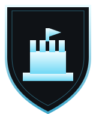

<div align="center">



# WvW Relink Checker

**Find out which WvW team your alliance landed on — in one paste.**

A web tool for Guild Wars 2 World vs World. Paste a list of guild names
and see which team each one landed on after a relink, plus live tier
standings and interactive maps for every NA and EU match.

[](https://wvwrelink.com/)
[](LICENSE)
[](#-project-layout)
[](#-project-layout)

### [→ Open the live tool](https://wvwrelink.com/)

*No account · No API key · Nothing to install · The link **is** the tool*

</div>

https://github.com/user-attachments/assets/372a3ade-0d54-4f39-aa1f-d4fc1354904d

## 🎯 Why this exists

After every relink, alliance members ask the same question: **which
server did we land on?** Answering it by hand means looking up each
guild's ID and cross referencing it against the API one at a time.

This does it for a whole list at once, and puts live match data around
the answer.

## ✨ Features

|  |  |
|---|---|
| 🔍 | **Guild lookup** — paste names, get the team each one landed on |
| 📋 | **One-click summaries** — sized for in-game chat, or for Discord |
| 📊 | **Live standings** — every NA and EU tier, refreshing on their own |
| 🗺️ | **Interactive maps** — all four battlegrounds, objectives live |
| 📈 | **Match detail** — weekly skirmish scores, per-map K/D, alliances per server |
| ⏱️ | **Timers** — relink and season lockout, with an alert before the lockout closes |

> [!NOTE]
> Guild names must match **exactly** — the API only does exact search, not
> partial or tag matches. A raw GUID works too. Up to 60 per run. The
> alliance list behind the shield icon is NA only.

## ⚙️ How it works

Guild names are resolved to IDs through the API's guild search, then
matched against live match data to find each one's team, tier and side.
Team names come from ArenaNet's published list, since no endpoint
resolves them.

Standings load once and keep refreshing in the background, so most checks
reuse data the page already has. The NA alliance list is a public Google
Sheet maintained by the NA WvW Discord, read only when you click a shield
icon.

## 🔒 Privacy

**Everything runs in your browser. There is no backend of mine to send
anything to.**

| Host | What for |
|---|---|
| `api.guildwars2.com` | The guild names you paste go here to be resolved — that request *is* the lookup. Also all match, objective and upgrade data. |
| `render.guildwars2.com` | Guild emblem images, for objectives claimed by a guild. Images only. |
| `docs.google.com` | Only when you click a shield icon: a read-only CSV export of the community guild sheet. |
| `melquiisedeq.goatcounter.com` | One anonymous page view per visit. Nothing else. |

The guild list you type is saved in local storage under
`wvw-relink-checker:guilds` so it is still there next time, and that copy
never leaves your device.

<details>
<summary><b>About the visit counter</b></summary>

<br>

Visits are counted with [GoatCounter](https://www.goatcounter.com): no
cookies, no fingerprinting, no persistent identifier. One request per
page load records the page address, referrer, title, screen width and
country — and nothing you type. Its script is served from this repository
rather than a CDN.

To keep your own browser out of the count, run `localStorage.skipgc = 't'`
in the developer console on the site.

</details>

## 🛡️ Security

A strict Content Security Policy denies everything by default and allows
only the four hosts above. Every script is served from this repository —
no CDN, no third-party code. Anything the API or the community sheet
returns is treated as text, never as markup.

The reasoning for each of these lives in a comment next to the code that
does it.

## ⚠️ Limitations

- Match data updates inconsistently on ArenaNet's end, which no amount of
  client-side polling can fix.
- Team names come from a static table in `js/config.js`, since the API has
  no endpoint for them. A scheduled GitHub Action fails when the live team
  IDs drift from that table.
- The NA alliance list is community-maintained — not by ArenaNet, not by
  this project — and may be incomplete or out of date.
- The score for the 2-hour block being played lands about 15 minutes late.
  Until it does, the trend popover says so rather than inventing a number.
- Guild emblems are monochrome: the API returns their colors as dye IDs
  that need an undocumented transform to resolve.

## 📁 Project layout

Plain static files. `index.html` sits at the repository root, which is all
GitHub Pages needs in order to serve it.

```
index.html   markup, the CSP, and the ordered list of scripts
css/         one stylesheet per concern
js/          one file per concern, loaded in order; boot.js runs last
assets/      map renders, game icons, and the screenshot
```

The scripts are plain (non-module) and share one global scope, so the
order in `index.html` matters: `config.js` and `dom.js` come first because
everything reads them, and `boot.js` comes last because it starts the
page.

## 📜 Disclaimer & license

This is an unofficial, fan made tool. It is not affiliated with, endorsed,
or sponsored by **ArenaNet** or **NCsoft**. All game content belongs to
its respective owners. Data is pulled live from the official Guild Wars 2
API.

Released under the [MIT license](LICENSE). `js/count.js` is GoatCounter's
counting script, used unmodified under the ISC license; its license header
is preserved in the file.

<div align="center">
<br>

**[wvwrelink.com](https://wvwrelink.com/)**

</div>
